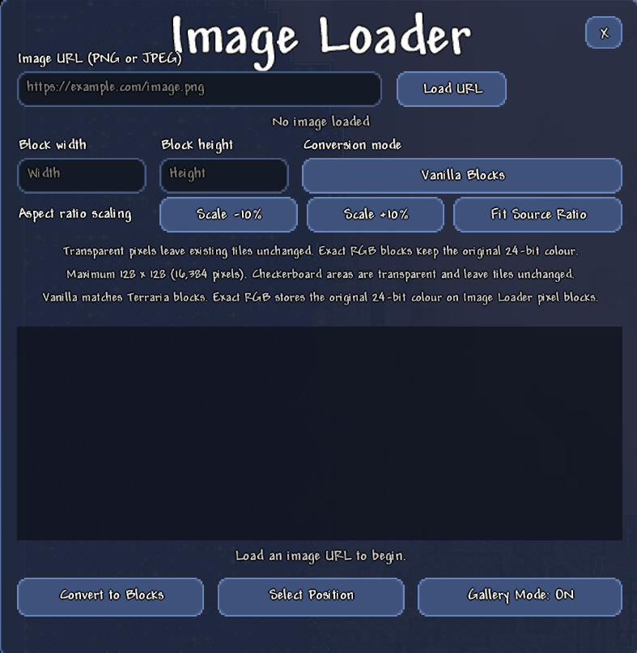
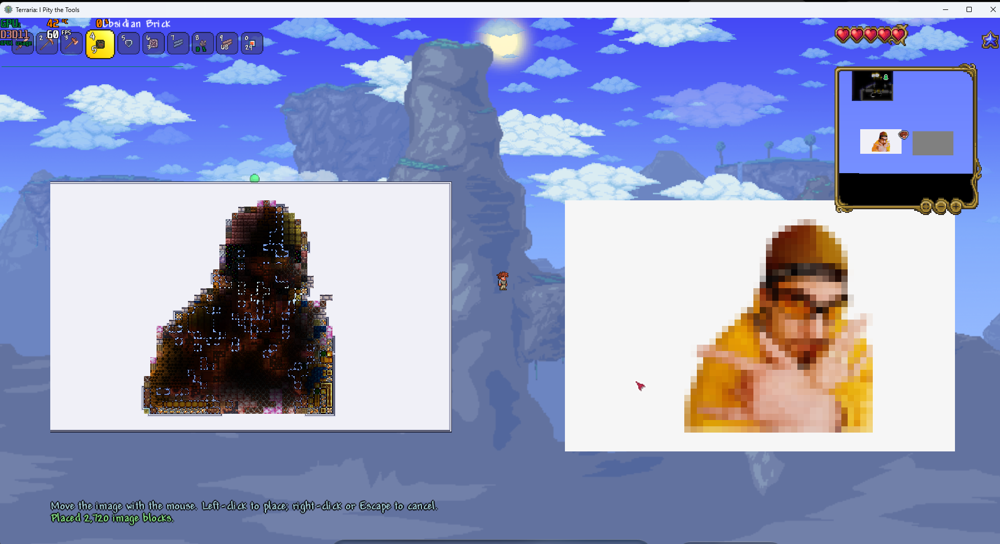

<p align="center">
  
</p>

<p align="center">
  <a href="../../stargazers"></a>
  <a href="../../releases/latest"></a>
  
  
</p>

<p align="center">
  Load a PNG or JPEG from a URL, turn it into blocks, preview it, and place it directly into a Terraria world.
</p>

---

## What Image Loader does

Image Loader is a tModLoader mod for building pixel art and large galleries without manually placing thousands of blocks. Paste an image URL, choose a resolution and conversion mode, review the preview, then choose a position in the world.

It includes two conversion workflows:

- **Vanilla Blocks** finds the closest safe solid Terraria block colour for every visible image pixel.
- **Exact RGB** stores the original 24-bit colour in Image Loader pixel blocks for a much closer visual copy.

The placement system works in normal non-Journey worlds. It does not consume inventory items. In multiplayer, the server validates and performs the placement rather than trusting a client-side world edit.

## Screenshots

<p align="center">
  
</p>

<p align="center"><em>URL loading, resolution controls, preview, and placement from one menu.</em></p>

<p align="center">
  
</p>

<p align="center"><em>Gallery Mode makes large image installations easier to inspect.</em></p>

## Feature overview

### Image loading

- Loads direct `http://` and `https://` PNG or JPEG URLs.
- Enforces download, timeout, and source-resolution limits.
- Shows the source dimensions and alpha information after loading.
- Uses a grey-and-white checkerboard so transparent and partially transparent areas are visible.
- Includes a **Clear URL** button without discarding the already loaded preview.
- Keeps long URLs inside the input region instead of drawing over adjacent controls.

### Resolution and scaling

- Choose an output width and height up to 128×128 blocks.
- Maximum conversion size is 16,384 cells.
- Scale the current aspect-locked size down or up by 10%.
- Restore the source aspect ratio in one click.

### Vanilla Blocks

- Uses safe solid, non-falling, non-platform Terraria tiles.
- Finds the closest map colour for each image sample.
- Places blocks without consuming player inventory.
- Applies fullbright coating so large vanilla mosaics remain visible in darkness.
- Leaves transparent source pixels unchanged in the world.

### Exact RGB

- Preserves the source RGB value instead of reducing it to the vanilla palette.
- Uses one custom Image Loader tile per visible output pixel.
- Persists colour data in the world save.
- Synchronizes colour data to joining multiplayer clients.
- Draws the correct colours on the full map and minimap.
- Drops a real colour-carrying block item when broken.
- Names the dropped item from its stored value, such as `RGB 248, 34, 230`.
- Restores the same RGB value when the item is placed again.
- Can be disabled in the server-side mod configuration.

### Placement

- The image follows the mouse while choosing a position.
- Left-click confirms placement.
- Right-click or Escape cancels and returns to the menu.
- Existing tiles are replaced only for visible converted cells.
- Transparent or rejected cells leave existing world tiles untouched.
- Placement supports Classic, Expert, Master, and Journey worlds.
- Multiplayer payloads are compacted and validated by the server.

### Gallery Mode

- Toggle a spectator-like viewing state with `G` by default.
- Fly through blocks with `W`, `A`, `S`, and `D`.
- Hold Shift for fast movement.
- Hold Ctrl for precise movement.
- Zoom in with Ctrl + mouse wheel or Page Up.
- Return toward normal 100% zoom by scrolling down; Gallery Mode never zooms farther out than the normal viewport.
- Supports a 100%–400% gallery zoom range.
- Hides the player and prevents damage while Gallery Mode is active.
- Locks vanilla inventory/hotbar scrolling while Ctrl + wheel controls the camera.
- Shows one persistent zoom label instead of filling chat with zoom messages.
- Adds a bright local light at the Gallery camera/player position so nearby blocks remain visible underground.

### Void Gallery worlds

- Optional server-side world-generation mode.
- Generates an empty display world for artwork and galleries.
- Keeps a bright daytime presentation instead of producing a black screen.
- Starts Gallery Mode automatically when it is enabled.
- Stores the Void Gallery marker in the world save and synchronizes it in multiplayer.

## Installation

### Option 1: GitHub release

1. Open the [Releases](../../releases) page.
2. Download the `.tmod` file for the tModLoader version listed in that release.
3. Close tModLoader.
4. Copy the file into:

   ```text
   Documents\My Games\Terraria\tModLoader\Mods
   ```

5. Start tModLoader, open **Workshop → Manage Mods**, enable **Image Loader**, and reload mods.

Preview builds may use a separate save directory such as `tModLoader-preview`. Install the file into the `Mods` folder belonging to the build you actually launch.

### Option 2: Build from source

1. Install Terraria and tModLoader through Steam.
2. Clone this repository into your tModLoader `ModSources` folder:

   ```powershell
   git clone https://github.com/seadragxn/ImageLoader.git "$HOME\Documents\My Games\Terraria\tModLoader\ModSources\ImageLoader"
   ```

3. Start tModLoader.
4. Open **Workshop → Develop Mods → Build + Reload** beside Image Loader.

The project imports the local tModLoader build targets and targets .NET 8/C# 12.

### Option 3: Copy an existing source checkout

Copy the repository folder to:

```text
Documents\My Games\Terraria\tModLoader\ModSources\ImageLoader
```

Then use **Build + Reload** from the Develop Mods menu. This is useful when testing the `experimental` branch.

## Quick start

1. Enter a world.
2. Press `P` to open Image Loader.
3. Paste a direct PNG or JPEG URL.
4. Select **Load URL**.
5. Set the block width and height.
6. Choose **Vanilla Blocks** or **Exact RGB**.
7. Select **Convert to Blocks**.
8. Review the preview and recognition count.
9. Select **Select Position**.
10. Move the preview and left-click to place it.

The `/imageloader` chat command also opens the menu.

## Controls

| Action | Default | Notes |
| --- | --- | --- |
| Open Image Loader | `P` | Also available as `/imageloader` |
| Toggle Gallery Mode | `G` | Enter a world first |
| Gallery movement | `W` `A` `S` `D` | Noclip movement |
| Fast gallery movement | `Shift` | Hold while moving |
| Precise gallery movement | `Ctrl` | Hold while moving |
| Gallery zoom in / reset | `Ctrl` + wheel | Clamped to 100%–400%; inventory scrolling is suppressed |
| Gallery zoom in | `Page Up` | Rebindable |
| Confirm placement | Left mouse | Places the prepared image |
| Cancel placement | Right mouse / `Escape` | Returns to the menu |

All registered keybinds can be changed in Terraria's Controls menu.

## Choosing a conversion mode

| Mode | Best for | Trade-off |
| --- | --- | --- |
| Vanilla Blocks | Survival-compatible palettes, maps, block mosaics | Limited to available safe tile colours |
| Exact RGB | Logos, photos, detailed art, faithful colours | Requires Image Loader to remain enabled for colour metadata |

If the goal is visual fidelity, start with Exact RGB. If the result should be made from recognizable Terraria materials, use Vanilla Blocks. A flattened Terraria screenshot can be imported as visual pixel art with Exact RGB, but Image Loader does not claim to reconstruct hidden Terraria block metadata from screenshots.

## Configuration

Image Loader currently provides these server-side settings:

| Setting | Default | Effect |
| --- | --- | --- |
| Enable Exact RGB Blocks | On | Allows custom 24-bit image tiles |
| Enable Gallery Mode | On | Allows spectator-style viewing and noclip |
| World Generation Mode | Vanilla | Choose Vanilla or Void Gallery for newly generated worlds |

Changing the world-generation option affects new world generation. It does not erase an existing normal world.

## Multiplayer and safety

- Placement requests are checked for world bounds, dimensions, cell count, conversion mode, and valid tile types.
- The server performs the actual world mutation.
- Exact RGB data is sent in chunks and synchronized when clients enter the world.
- Vanilla placements use run-length encoding to reduce packet size.
- The maximum 128×128 placement limit protects the game from unexpectedly huge operations.
- URL loading is client-side and has a download timeout and size limit.

Only install mods and release files from sources you trust. Back up important Terraria worlds before using any world-editing mod.

## Compatibility

| Image Loader | Terraria | tModLoader | Status |
| --- | --- | --- | --- |
| 0.7.0 | 1.4.4.9 | 2026.08 preview line | Current tested build |
| 0.6.0 | 1.4.4.9 | 2026.08 preview line | Superseded experimental schematic release |
| 0.5.2 | 1.4.4 | Matching 1.4.4 preview build | Legacy binary/source tag |

Image Loader is written for the Terraria 1.4.4 tModLoader API. A `.tmod` package is tied to the tModLoader build line that compiled it, so releases identify their tested loader version. Source users can build against another compatible 1.4.4 tModLoader installation, but unlisted versions are not claimed as verified.

## Branches and releases

- `main` contains the latest stable release source.
- `experimental` is the integration branch for features that still need in-game validation.
- `legacy/0.5.x` preserves the final 0.5-series source.
- Stable releases use semantic version tags such as `v0.7.0`.
- Every release should include the matching `.tmod` package, compatibility note, and concise changelog.

## Building from the command line

With tModLoader installed in its standard Steam location:

```powershell
dotnet build ImageLoader.csproj
```

For day-to-day Terraria development, **Build + Reload** in tModLoader is preferred because it compiles, packages, and immediately reloads the mod in the correct environment.

## Troubleshooting

### Pressing P does nothing

- Check **Settings → Controls → Mod Controls → Image Loader**.
- Rebind **Open Image Loader** if another mod uses `P`.
- Try `/imageloader` in chat.
- Confirm the mod is enabled and mods were reloaded.

### A URL will not load

- Use a direct image URL rather than a webpage containing an image.
- Confirm the address begins with `http://` or `https://`.
- Try opening the URL in a browser to confirm it returns a PNG or JPEG.
- Very large downloads and source images over 8 megapixels or 8192 pixels per side are rejected before GPU decoding.

### Transparent areas place blocks

- JPEG does not support transparency; use PNG.
- Confirm transparency appears as a checkerboard in the preview.
- Some websites display a checkerboard baked into the image. Those grey and white squares are ordinary opaque pixels and cannot be treated as alpha automatically.

### A broken Exact RGB block loses its colour

Version 0.7.0 drops a non-stacking item named with its stored RGB value and restores that value when placed. Make sure the world and all multiplayer clients use 0.7.0 or newer.

### The image looks dark

New vanilla image placements use fullbright coating. If an older placement predates that change, convert and place it again.

### The map does not show Exact RGB colours

Make sure all players are using the same Image Loader version, reconnect to request a fresh colour-data sync, and allow the minimap to reveal the area normally.

### Gallery Mode will not zoom out below 100%

This is intentional. Terraria does not reliably render world content outside its normal viewport, so version 0.7.0 removed misleading below-100% zoom-out and retained zoom-in only.

## Development notes

The project is organized by responsibility:

```text
Common/
  Config/       Server-side feature and world-generation settings
  Data/         Prepared image and conversion-mode data
  Map/          Exact RGB map/minimap drawing
  Players/      Gallery movement, protection, zoom, and sync
  Services/     Image palettes, placement, and RGB storage
  Systems/      UI, camera/render bounds, lighting, and world generation
  Tiles/        Exact RGB pixel tile behavior
  UI/           Menu, text input, and image preview controls
```

Pull requests should keep placement server-authoritative, preserve transparent-cell behavior, avoid blocking network work on the main thread, and include an in-game test description.

## Roadmap

Potential future work includes:

- Optional local image-file loading.
- Colour-palette presets and dithering controls.
- Paint and coating support for vanilla mosaics.
- Undo/redo snapshots for large placements.
- Saved local presets and recent URLs.
- Dedicated stable packages for additional verified tModLoader build lines.

Roadmap items are ideas, not promises. The `experimental` branch is where incomplete work belongs.

## Contributing

1. Fork the repository.
2. Create a branch from `experimental`.
3. Keep each change focused.
4. Build against the documented tModLoader version.
5. Test image loading, preview, cancellation, placement, world reload, map view, and Gallery Mode where relevant.
6. Open a pull request with reproduction steps and screenshots.

Bug reports are most useful when they include the Image Loader version, tModLoader version, single-player or multiplayer status, conversion mode, source dimensions, output dimensions, and a screenshot of the preview/result.

## Credits

Image Loader is authored by **seadragxn** and built for the Terraria/tModLoader community.

Terraria and tModLoader are trademarks of their respective owners. This project is an independent community mod and is not affiliated with or endorsed by Re-Logic or the tModLoader team.

---

<p align="center">
  If Image Loader saves you a few thousand block placements, consider giving the repository a star.
</p>
